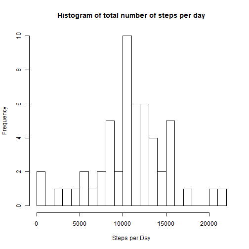
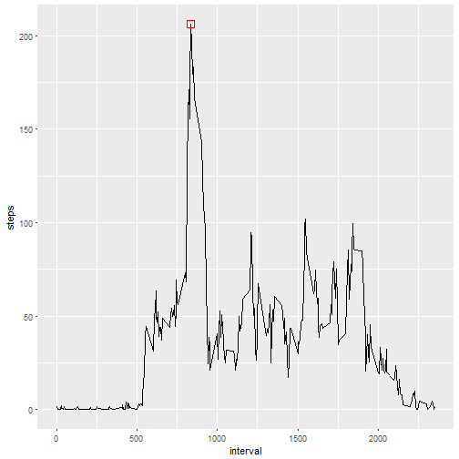
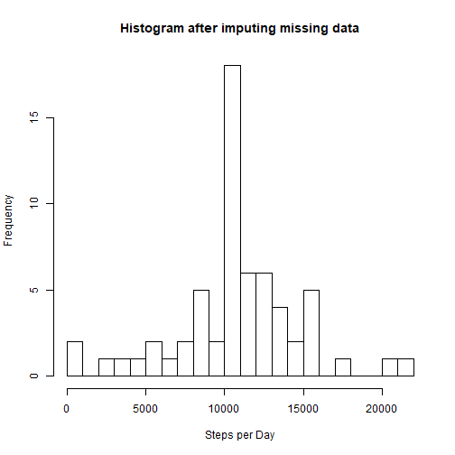

Analysis of Activity Data
=========================
  
### Loading and preprocessing the data
Read the data in the activity.csv file.  
Process the data setting date to Date format and interval to factor mode.


```r
if (!file.exists("Data/activity.csv")) {
    download.file(url = "https://d396qusza40orc.cloudfront.net/repdata%2Fdata%2Factivity.zip", 
        destfile = "data/activity.zip", method = "auto")
    unzip("data/activity.zip", exdir = "Data")
}
activity <- read.csv("activity.csv", colClasses = c("integer", "Date", "character"))
```

### What is mean total number of steps taken per day?
For this part of the assignment, you can ignore the missing values in the dataset.

1. Calculate the total number of steps taken per day
2. If you do not understand the difference between a histogram and a barplot, research the difference between them. Make a histogram of the total number of steps taken each day
3. Calculate and report the mean and median of the total number of steps taken per day


```r
stepsPerDay <- aggregate(steps~date, data= activity, sum)
hist(stepsPerDay$steps, breaks=20, xlab="Steps per Day", main="Histogram of total number of steps per day")
```



```r
summary(stepsPerDay$steps) ## mean and median of the total number of steps taken per day
```

```
##    Min. 1st Qu.  Median    Mean 3rd Qu.    Max. 
##      41    8841   10765   10766   13294   21194
```

### What is the average daily activity pattern?
1. Make a time series plot (i.e. type = "l") of the 5-minute interval (x-axis) and the average number of steps taken, averaged across all days (y-axis)
2. Which 5-minute interval, on average across all the days in the dataset, contains the maximum number of steps?


```r
pattern <- aggregate(steps~interval, data=activity, mean)
pattern$interval <- as.numeric(pattern$interval)
maxSteps <-  pattern[order(pattern[,2], decreasing=TRUE)[1],]
library(ggplot2)
g <- ggplot(pattern, aes(x=interval, y=steps))
g + geom_line()+
geom_point(data = maxSteps, aes(x=interval, y=steps), color="red", size=4, pch=22)
```



```r
maxSteps ## The interval with the maximum number of steps
```

```
##     interval    steps
## 272      835 206.1698
```

## Imputing missing values
Note that there are a number of days/intervals where there are missing values (coded as NA). The presence of missing days may introduce bias into some calculations or summaries of the data.

1. Calculate and report the total number of missing values in the dataset (i.e. the total number of rows with NAs)
Devise a strategy for filling in all of the missing values in the dataset. The strategy does not need to be sophisticated. For example, you could use the mean/median for that day, or the mean for that 5-minute interval, etc.
2. Create a new dataset that is equal to the original dataset but with the missing data filled in.
3. Make a histogram of the total number of steps taken each day and Calculate and report the mean and median total number of steps taken per day. Do these values differ from the estimates from the first part of the assignment? What is the impact of imputing missing data on the estimates of the total daily number of steps?


```r
num_of_NAs <- sum(is.na(activity$steps))
num_of_NAs ##  total number of missing values
```

```
## [1] 2304
```
USe the mean for the corresponding 5-minute interval

```r
imputeData <- activity
for (i in 1:nrow(imputeData)) {
    if (is.na(imputeData$steps[i])) {
        imputeData$steps[i] <- pattern[which(pattern$interval == imputeData$interval[i]), ]$steps[1]
    } 
}
sum(!complete.cases(imputeData)) ## proof that all missing vaues have been filled in
```

```
## [1] 0
```

```r
stepsEachDay <- aggregate(steps~date, data= imputeData, sum)
hist(stepsEachDay$steps, breaks=20, xlab="Steps per Day", main="Histogram after imputing missing data")
```



```r
summary(stepsEachDay$steps) ## mean and median of the total number of steps taken per day
```

```
##    Min. 1st Qu.  Median    Mean 3rd Qu.    Max. 
##      41    9819   10766   10766   12811   21194
```
The impact of imputing missing data on the estimates of the total daily number of steps is trivial.

## Are there differences in activity patterns between weekdays and weekends?

For this part the weekdays() function may be of some help here. Use the dataset with the filled-in missing values for this part.

1. Create a new factor variable in the dataset with two levels - "weekday" and "weekend" indicating whether a given date is a weekday or weekend day.
2. Make a panel plot containing a time series plot (i.e. type = "l") of the 5-minute interval (x-axis) and the average number of steps taken, averaged across all weekday days or weekend days (y-axis). See the README file in the GitHub repository to see an example of what this plot should look like using simulated data.


```r
daytype <- function(date) {
    if (weekdays(as.Date(date)) %in% c("Saturday", "Sunday")) {
        "weekend"
    } else {
        "weekday"
    }
}
imputeData$daytype <- as.factor(sapply(imputeData$date, daytype))
library(lattice)
meanSteps <- aggregate(imputeData$steps, 
        list(as.numeric(imputeData$interval), imputeData$daytype), FUN=mean)
names(meanSteps) <- c("interval", "weekDays", "avgSteps")
xyplot(avgSteps ~ interval | weekDays, data = meanSteps,
    layout = c(1,2), type="l",
    xlab="Interval", ylab="Number of Steps")
```


